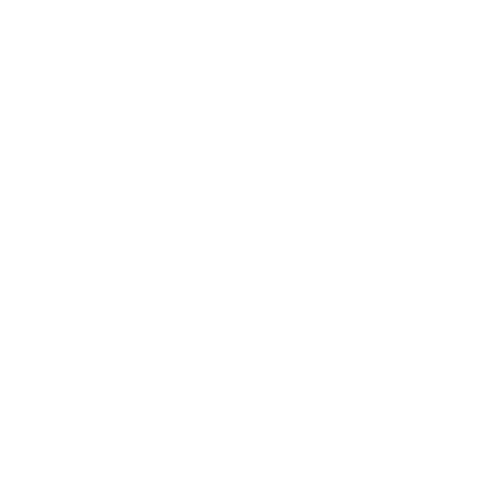

# UWApp
Universal Web Application (UWApp) is a template web application utilizing a customizable Python Django backend that can be hosted on an Elastic Beanstalk AWS server.
<p align="center">
  
</p>

## Purpose
A personal template repository for future web application development. Easy installation, setup, and configuration for all applications.

## Features
- Django backend. Utilizing function based views that render template HTML files.
- User registration and authentication with login views and models.
- Pay-wall ready custom user model.
- SQLite database.
- Easily add accessory Django applications.
- React frontend with customizable components.

## Installation and Initial Setup
1. Install the prerequisites for creating an Elastic Beanstalk AWS Django application:
    - Python 3.7 or later
    - NPM
```
C:\> pip install virtualenv
``` 
2. Clone the UWApp repository:
```
C:\> git clone https://github.com/adamloec/UWApp
```
3. Create a virtual environment inside of the repository:
```
C:\> cd UWApp
C:\UWApp> virtualenv .venv
```
4. Install and Initialize React Packages:
```
C:\UWApp\uwapp\frontend> npm install
C:\UWApp\uwapp\frontend> npm run build
```
4. Active the virtual environment and run the application locally:
```
C:\UWApp> .venv/Scripts/activate
C:\UWApp\uwapp> python manage.py makemigrations uwapp
C:\UWApp\uwapp> python manage.py migrate
C:\UWApp\uwapp> python manage.py runserver
```
5. To close the server and virtual environment:
```
C:\UWApp\uwapp> CTRL^C
C:\UWApp\uwapp> deactivate
```

# Submodules
Submodules are used inside of UWApp to manage all peripheral applications.
There will be 2 developer cases for managing submodules:
- Working on submodules outside of the main UWApp repository.
- Working on submodules inside of the main UWApp repository.

:warning: **All submodules will be located inside of UWApp/uwapp**

## Updating and managing submodules
- Merge the latest commits for all submodules:
```
C:\UWApp> git submodule update --remote --merge
```
- Push the latest submodule branch(s) to the main UWApp repository:
```
C:\UWApp> git add --all
C:\UWApp> git commit -m ""
C:\UWApp> git push
```
## Working on submodules inside of the main UWApp repository
After making changes to a submodule located inside of your working UWApp repository, the submodule and main UWApp branch need to be updated for the changes to be tracked.
- Add and push all changes made to the submodule:
```
C:\UWApp\uwapp\submodule> git add {UPDATED_CONTENTS}
C:\UWApp\uwapp\submodule> git commit -m ""
C:\UWApp\uwapp\submodule> git push
```
- After changes were pushed to the submodule repository, fetch the latest commits and push them to the main UWApp repository:
```
C:\UWApp> git fetch
C:\UWApp> git add --all
C:\UWApp> git commit -m ""
C:\UWApp> git push
```
