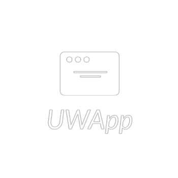

# UWApp
Universal Web Application (UWApp) is a template web application utilizing a customizable Python Django backend that can be hosted on an Elastic Beanstalk AWS server.
<p align="center">
  
</p>

## Purpose
A personal template repository for future web application development. Easy installation, setup, and configuration for all applications.

## Features
- Django backend. Utilizing function based views that render template HTML files.
- User registration and authentication with login views and models.
- Pay-wall ready custom user model.
- SQLite database.
- Easily add accessory Django applications.
- React frontend with customizable components.

## Installation and Initial Setup
1. Install the prerequisites for creating an Elastic Beanstalk AWS Django application:
    - Python 3.7 or later
    - NPM
```
C:\> pip install virtualenv
``` 
2. Clone the UWApp repository:
```
C:\> git clone https://github.com/adamloec/UWApp
```
3. Create a virtual environment inside of the repository:
```
C:\> cd UWApp
C:\UWApp> virtualenv .venv
```
4. Install and Initialize React Packages:
```
C:\UWApp\uwapp\frontend> npm install
C:\UWApp\uwapp\frontend> npm run build
```
4. Active the virtual environment and run the application locally:
```
C:\UWApp> .venv/Scripts/activate
C:\UWApp\uwapp> python manage.py makemigrations uwapp
C:\UWApp\uwapp> python manage.py migrate
C:\UWApp\uwapp> python manage.py runserver
```
5. To close the server and virtual environment:
```
C:\UWApp\uwapp> CTRL^C
C:\UWApp\uwapp> deactivate
```

## Create and Add Django Applications
1. Create or add a new Django application inside of UWApp (Replace "new_app" with the name of the new application):
```
C:\UWApp> .venv/Scripts/activate
C:\UWApp\uwapp> python manage.py startapp new_app
```
2. Add the new application to `uwapp/settings.py`:
```
INSTALLED_APPS = [
    'django.contrib.admin',
    'django.contrib.auth',
    'django.contrib.contenttypes',
    'django.contrib.sessions',
    'django.contrib.messages',
    'django.contrib.staticfiles',
    'uwapp',
    'new_app',
]
```
3. Add the urls for the new application to `uwapp/urls.py`:
```
urlpatterns = [
    path('admin/', admin.site.urls),
    path('', views.home, name='home'),
    path('register/', views.registration, name='register'),
    path('login/', views.login, name='login'),
    path('dashboard/', views.dashboard, name='dashboard'),
    path('new_app/', include('new_app.urls')),
]
```

Now that these additions to UWApp were made, it can be further customized to accomodate for the new application urls/views.